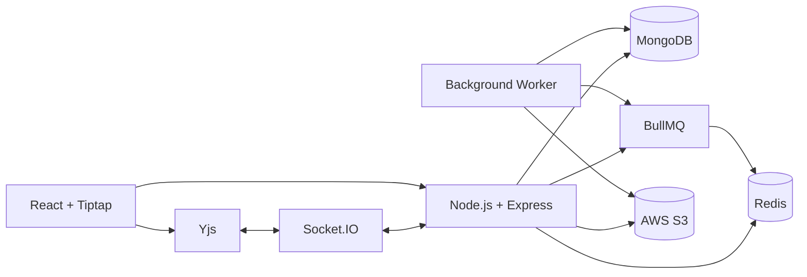

# WriteFlow

> A real-time collaborative document editor built with React, Tiptap, Yjs, Socket.IO, Node.js, MongoDB, Redis, BullMQ, and AWS S3.

WriteFlow is a web-based document editor that allows users to create, edit, and share rich-text documents while collaborating with other users in real time.

The project focuses on building the core systems behind a collaborative editor — **real-time synchronization, document persistence, access control, background processing, and asset management** — rather than treating documents as simple CRUD records.

---

## ✨ Features

### 📝 Rich Text Editor

Built with **Tiptap** on top of ProseMirror.

* Headings
* Bold, italic, underline
* Text colors and highlights
* Font family and font size
* Text alignment
* Bullet and ordered lists
* Nested task lists
* Tables with resizing
* Links
* Images
* Undo / redo
* Browser spellcheck
* Custom editor extensions

---

### 👥 Real-Time Collaboration

WriteFlow supports multiple users editing the same document simultaneously.

The collaboration system uses:

* **Yjs** for CRDT-based document state
* **Socket.IO** for real-time communication
* **Tiptap Collaboration** to connect the editor with Yjs
* **Yjs Awareness** for user presence and remote cursors

Instead of sending the entire document whenever a user types, the editor produces Yjs updates which are synchronized between connected clients.

A simplified flow:

```text
User edits document
        ↓
      Tiptap
        ↓
       Yjs
        ↓
   Socket.IO
        ↓
 Server-side Y.Doc
        ↓
 Broadcast to other users
```

This allows concurrent edits to be merged through Yjs rather than manually replacing document content.

---

### 🔐 Authentication

WriteFlow supports:

* Email/password authentication
* Google OAuth
* Password hashing with bcrypt
* Server-side sessions stored in Redis
* HTTP-only authentication cookies

Sessions are stored server-side rather than putting the complete session state inside a browser-accessible token.

---

### 🔗 Document Sharing

Document owners can share documents using different access levels:

* **Read**
* **Write**
* **Owner**

Owners can create named share links with either read or write permissions.

They can also:

* View existing share links
* Revoke share links
* Manage users with access
* Change user permissions
* Approve access requests
* Deny access requests

Users can request permanent access to documents they do not currently have access to.

---

### 🖼️ Image Uploads

Images are uploaded directly from the browser to **AWS S3** using presigned URLs.

The flow is:

```text
Browser
   ↓
Request presigned URL
   ↓
Backend
   ↓
S3 presigned URL
   ↓
Browser uploads directly to S3
   ↓
Backend verifies uploaded asset
   ↓
Asset marked as ready
```

This keeps image data out of the main Express request path.

WriteFlow also tracks document assets and runs a background cleanup job to remove image assets that are no longer referenced by a document.

---

### 🖨️ Document Printing

Documents can currently be printed directly from the browser.

The frontend prepares the document content, resolves image URLs, waits for images to load, and then invokes the browser's print functionality.

Server-side PDF generation using Puppeteer is planned for a future iteration.

---

### ⚙️ Background Processing

WriteFlow uses **BullMQ** with Redis for background processing.

Currently, background jobs are used for:

* Document persistence
* Unused image cleanup

Document changes are kept in the active Yjs document while users collaborate. Periodically, the current Yjs state is encoded and queued for persistence.

```text
Active Y.Doc
     ↓
Periodic snapshot
     ↓
BullMQ
     ↓
Background Worker
     ↓
MongoDB
```

The document is also persisted when the last collaborator leaves the document.

Background document-saving jobs use retries with exponential backoff to handle temporary failures.

---

## 🏗️ Architecture



### Main responsibilities

| Component         | Responsibility                               |
| ----------------- | -------------------------------------------- |
| React             | Frontend application                         |
| Tiptap            | Rich-text editor                             |
| Yjs               | Collaborative document state / CRDT          |
| Socket.IO         | Real-time synchronization                    |
| Node.js + Express | REST API and application backend             |
| MongoDB           | Persistent application and document data     |
| Redis             | Sessions, caching, and BullMQ infrastructure |
| BullMQ            | Background job processing                    |
| Worker            | Document persistence and asset cleanup       |
| AWS S3            | Image storage                                |

---

## 🔄 Document Persistence

One of the important design decisions in WriteFlow is separating **real-time collaboration** from **durable persistence**.

The active collaborative document exists as a Yjs document on the server while users are connected.

Instead of writing to MongoDB for every editor event, the current state is periodically encoded and sent to a BullMQ worker.

```text
                    Real-time path

Tiptap
  ↓
Yjs
  ↓
Socket.IO
  ↓
Server Y.Doc
  ↓
Other connected clients


                    Persistence path

Server Y.Doc
  ↓
Y.encodeStateAsUpdate()
  ↓
BullMQ
  ↓
Worker
  ↓
MongoDB
```

MongoDB stores the encoded Yjs document state as binary data.

This keeps frequent editor activity away from the database write path while still periodically persisting the document.

### Save behavior

* Document state is periodically persisted.
* BullMQ retries failed persistence jobs.
* The current document is synchronously persisted when the last collaborator leaves.
* Completed queue jobs are automatically removed.

---

## 🔑 Access Control

WriteFlow separates document access from the document itself using access records.

A document can have multiple users with different access levels:

```text
Document
   │
   ├── Owner
   ├── Write access
   └── Read access
```

There are also separate share tokens:

```text
Document
   │
   ├── Read Share Link
   └── Write Share Link
```

When a request is authenticated as a normal user, the user's document-level permission is checked first. Share-token access is considered when a user-level access record does not exist.

This provides a simple distinction between:

* **Permanent user access**
* **Share-link access**

---

## 🗃️ Data Model

WriteFlow uses MongoDB with Mongoose.

### User

Stores:

* Username
* Email
* Password hash for local accounts
* Authentication providers

### Document

Stores:

* Title
* Owner
* Encoded Yjs document state
* Timestamps

### DocumentAccess

Represents a user's access to a document:

```text
user + document + accessLevel
```

Access levels:

```text
read
write
owner
```

### DocumentAccessRequest

Stores requests from users asking for access to a document.

### DocumentAccessToken

Stores named share links and their associated access level.

### DocumentAsset

Tracks images stored in S3 and their relationship with documents.

---

## 🔒 Security

Some of the security mechanisms implemented include:

* Password hashing with bcrypt
* Server-side Redis sessions
* HTTP-only cookies
* Secure cookies
* CORS configuration
* Cryptographically random share tokens
* Document-level authorization
* Owner-only permission management
* Access-level checks for editing and uploads
* Short-lived S3 presigned upload URLs
* File type and size validation for image uploads
* Verification of uploaded S3 objects before marking assets as ready
* Socket.IO authentication using signed collaboration tokens

---

## 🧩 Project Structure

```text
Docs/
├── backend/
│   ├── config/
│   │   ├── mongo.js
│   │   └── redis.js
│   │
│   ├── controller/
│   │   ├── authentication.js
│   │   ├── collaboration.js
│   │   └── document.js
│   │
│   ├── middlewares/
│   │   └── authorisation.js
│   │
│   ├── models/
│   │   ├── userModel.js
│   │   ├── documentModel.js
│   │   ├── documentAccessModel.js
│   │   ├── documentAccessRequestModel.js
│   │   ├── documentAccessToken.js
│   │   └── documentAssetModel.js
│   │
│   ├── routes/
│   │   ├── authentication.js
│   │   └── document.js
│   │
│   ├── background-jobs/
│   │   ├── queue.js
│   │   └── worker.js
│   │
│   ├── utils/
│   │   ├── saveDocuments.js
│   │   ├── yDocUtils.js
│   │   └── s3.js
│   │
│   └── main.js
│
└── frontend/
    └── src/
        ├── components/
        ├── hooks/
        ├── lib/
        │   ├── api.js
        │   └── SocketProvider.js
        ├── routes/
        ├── App.jsx
        └── main.jsx
```

---

## 🛠️ Tech Stack

### Frontend

* React
* Vite
* Tiptap
* ProseMirror
* Yjs
* Socket.IO Client
* Axios
* Tailwind CSS
* React Router
* Motion
* Lucide Icons

### Backend

* Node.js
* Express
* Socket.IO
* Mongoose
* MongoDB
* Redis
* BullMQ
* ioredis
* JWT
* bcrypt

### Infrastructure / Services

* AWS S3
* Google OAuth
* Redis

---

## 🚀 Getting Started

### Prerequisites

Make sure you have:

* Node.js
* MongoDB
* Redis
* AWS S3 bucket
* Google OAuth credentials if Google authentication is required

### Backend

```bash
cd backend
npm install
npm run dev
```

The development command starts both the backend server and the background worker.

The backend runs on:

```text
http://localhost:8000
```

### Frontend

```bash
cd frontend
npm install
npm run dev
```

---

## 🔐 Environment Variables

### Backend

Create a `.env` file in `backend/`:

```env
MONGODB_URI=
REDIS_URL=
JWT_SECRET=

FRONTEND_URL=

GOOGLE_CLIENT_ID=
GOOGLE_CLIENT_SECRET=
GOOGLE_REDIRECT_URI=

AWS_ACCESS_KEY=
AWS_SECRET_ACCESS_KEY=
AWS_REGION=
AWS_S3_BUCKET=
```

### Frontend

Create a `.env` file in `frontend/`:

```env
VITE_BACKEND_API_URL=
VITE_GOOGLE_CLIENT_ID=
```

Never commit real credentials or secrets to the repository.

---

## 💡 Engineering Decisions

### Yjs for collaboration

Rather than synchronizing the entire document whenever a user makes an edit, WriteFlow uses Yjs to represent collaborative state.

This provides CRDT-based merging of concurrent changes and fits naturally with Tiptap's collaboration model.

### Real-time state vs persistence

The system separates the low-latency collaboration path from the database persistence path.

Users interact with the active Yjs document while MongoDB receives periodic snapshots through a background worker.

### BullMQ for background work

Document persistence and asset cleanup are handled asynchronously rather than making the main collaboration flow perform every database/storage operation itself.

This also allows failed persistence jobs to be retried.

### Direct S3 uploads

Images are uploaded directly from the browser using presigned URLs instead of passing the complete image through the backend.

This reduces the amount of binary data handled by the Express server.

### Separate read/write sharing

Share links explicitly represent their access level, allowing an owner to create a read-only link without granting editing capabilities.

---

## 📌 Current Limitations

WriteFlow is an actively evolving project. Some areas are intentionally left for future iterations:

* No document version history yet
* No offline editing persistence
* Collaboration state is currently maintained in the backend process
* No automated test suite yet
* Server-side Puppeteer PDF generation is planned
* Some authentication features such as password recovery are not implemented yet

---

## 🔮 Future Improvements

Planned improvements include:

* Server-side PDF generation using Puppeteer
* Document version history
* Offline editing support
* More robust collaboration persistence
* Improved automated testing
* Better scalability for multiple collaboration server instances
* Additional authentication and account recovery features
* Improved observability and monitoring

---

## 📚 API Overview

The backend exposes REST APIs for:

```text
/auth
├── register
├── login
├── me
└── google

/documents
├── create
├── list
├── read
├── rename
├── save
├── delete
│
├── access
├── access-token
├── access-request
│
├── collaboration
│
├── assets
└── pdf conversion
```

Real-time document synchronization is handled separately through Socket.IO.

---

## 🎯 What I Learned

Building WriteFlow involved working with several concepts beyond standard CRUD development:

* Real-time collaborative systems
* CRDT-based state synchronization
* WebSocket communication
* Tiptap/ProseMirror editor architecture
* Redis-backed sessions and queues
* Asynchronous background processing
* MongoDB data modeling
* Fine-grained authorization
* Presigned object-storage uploads
* Resource cleanup
* Failure retries and exponential backoff
* Client/server synchronization

The project was built to explore how the individual pieces of a collaborative application fit together rather than relying entirely on a managed collaborative-editor service.
